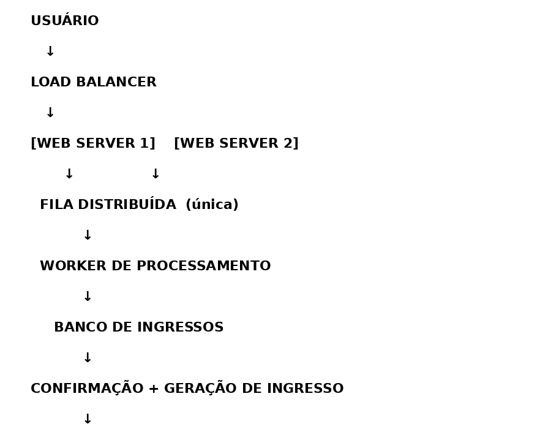

# 🎸 Arquitetura de Venda de Ingressos - Rock in Rio

## 📊 Diagrama SQL-like

```sql
USUARIO 
    -> LOAD_BALANCER 
        -> [WEB_SERVER_1, WEB_SERVER_2]

WEB_SERVER_1 -> FILA_DISTRIBUIDA
WEB_SERVER_2 -> FILA_DISTRIBUIDA

FILA_DISTRIBUIDA -> WORKER_PROCESSAMENTO

WORKER_PROCESSAMENTO -> BANCO_INGRESSOS

BANCO_INGRESSOS -> CONFIRMACAO_INGRESSO

CONFIRMACAO_INGRESSO -> ENVIO_USUARIO
```

## 🖼️ Diagrama Ilustrado


